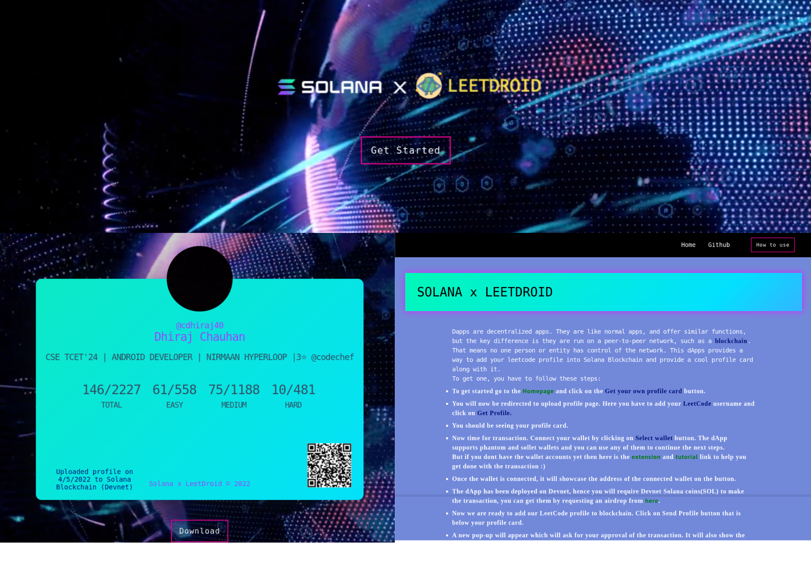

<b>Solana x LeetDroid</b> is a dApp (Decentralized application) that allows you to add your LeetCode profile into Solana Blockchain in easiest way. It supports more than 5 wallets and each one of them provide a pretty easy way to do the transaction. It also gives you a custom profile card with QR code embedded in it which gives you the transaction ID of the transaction after scanning it.  
To add your LeetCode profile into the blockchain, all you will need is a LeetCode Account and if you dont have one you can still have the fun by creating an account from [here](https://leetcode.com/accounts/signup/)
 Currently website supports for only leetcode users, the website fetches data from user's username.

## Why it was made:

The idea came when I was exploring blockchain projects particularly Solana ones and I found solana blockchain pretty interesting. I started learning about Solana (you can find the resources I used to create this dApp from [here](https://github.com/cdhiraj40/SolanaxLeetDroid/blob/master/RESOURCES.md)) and I became fond of it. Thats when I thought I want to make something on Solana blockchain and let a user add their profile to the blockchain. I already had an app based on LeetCode and it gave me an idea of getting started with this. Its pretty funny that my app gives your whole LeetCode profile in your pockets and this dApp made it possible for that profile to stay forever*

## What it does :

This project "<b>Solana x LeetDroid</b>" provides user to upload their profile into Solana Blockchain (Devnet). It lets user fetch their LeetCode profile via a simple UI. Once you have fetched your profile, you can connect to your wallet. The dApp provides more than 5 wallets and once you are connected you can send your profile into blockchain under 10 seconds. Yes its that fast!(Read more about Solana from [here](https://solana.com/news/getting-started-with-solana-development). It shows user the transaction ID which one can use it on home page to generate their custom profile card with a QR code embedded in it which gives you the transaction ID of the transaction after scanning it. So no need at all to remember your transaction ID. One can always regenerate their profile card after inputting their transaction ID. If you are new to dApps and dont know how to get started with this one? Dont worry at all! There is also a [how to use section](https://solanaxleetdroid-cdhiraj40.vercel.app/how-to-use)(or if you are fan of github readmes then same is [here](https://github.com/cdhiraj40/SolanaxLeetDroid/blob/master/GET_STARTED.md) too.) so any beginner can add their LeetCode profile to blockchain just like that. if you still face any issues feel free to create an issue, I would love to help. 

### Collage/Screenshots

## 👇 Prerequisites

Before installation, please make sure you have already installed the following tools:
The project is using [Anchor Framework](https://github.com/cdhiraj40/SolanaxLeetDroid/edit/master/README.md#:~:text=functionalities%20in%20dApp%20%3A-,Anchor%20Framework,-In%20basic%20terms) to build smart contracts.
- [Anchor Framework](https://project-serum.github.io/anchor/getting-started/installation.html)

some other optional prerequisites if you are interested in contributing.
- [Git](https://git-scm.com/downloads)

If you don't have a leetcode account you can create one from [here](https://leetcode.com/accounts/signup/)

## 🛠️ Installation Steps

1. Fork the project
2. Clone the project
3. Create a new branch (`git checkout -b new-feature`)
4. One can find smart contract in the ``program-rust/programs/solana-leetdroid/src/`` directory.
5. Make your changes and build the program by running ``anchor build``
6. Once built, connect to any [cluster](https://docs.solana.com/cli/choose-a-cluster) and run the deploy command which you got at the end of build command or just run ``anchor deploy``.
7. Once all the appropriate changes are done in the files (` git add . `)
8. Add changes to reflect the changes made (`git commit -m 'commit message'`)
9. Push to the branch (` git push `)

## 👨‍💻 Contributing

- Any contributions you make are **greatly appreciated**.

### Bug / Feature Request

If you find a bug in the dApp/website, kindly open an issue [here](https://github.com/cdhiraj40/SolanaxLeetDroid/issues/new) by
including a proper description about the bug and the expected result. Similarly, I would be glad to hear about new
features to add in the project, kindly follow same procedure for it too.

## 🛡️ License

Solana x LeetDroid is licensed under the MIT License - see the [`LICENSE`](LICENSE) file for more information.
